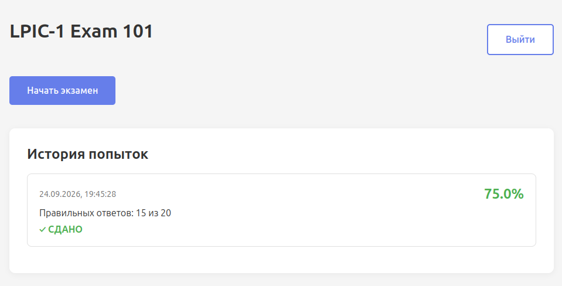
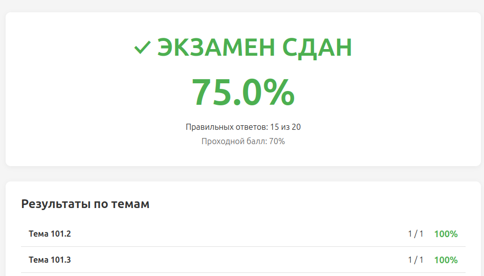
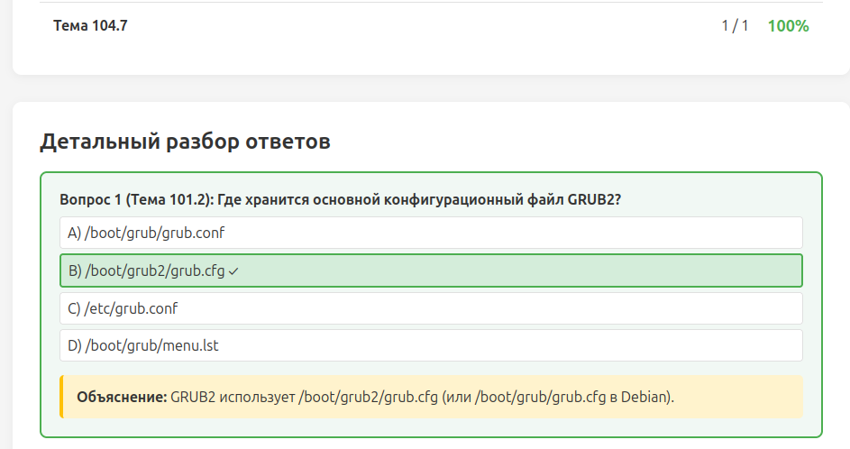
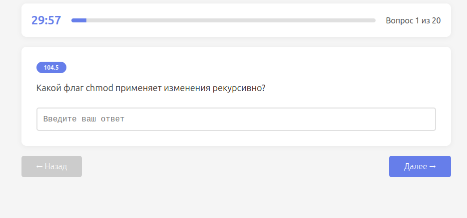

# LPIC-1 Exam 101 — Тренажёр

Веб-приложение для подготовки к экзамену LPI 101 (LPIC-1).

Сделано с помощью ИИ Qwen. Все вопросы сгенерированы на основе открытых описаний нейросетью.

## Быстрый старт (Docker)

### Требования

- Docker
- Docker Compose

### Запуск

```bash
# 1. Клонировать / скопировать проект
cd lpic1-exam

# 2. Запустить всё одной командой
docker compose up --build -d

# 3. Открыть в браузере
open http://localhost:8282

```

При открытии приложения выдается окно входа. Здесь же можно зарегистрироваться с помощью электронной почты. Почта не верифицируется, это просто локальная учетка, можно что угодно написать из почты.


После регистрации попадаете в свой личный кабинет, в котором можно увидеть попытки и результаты сдачи



Внутрь пройденного экзамена можно зайти и посмотреть результаты с комментариями





Нажав кнопку Начать экзамен попадаем в экзамен, где начинает отсчитываться обратный отсчет времени



Удачной тренировки!
